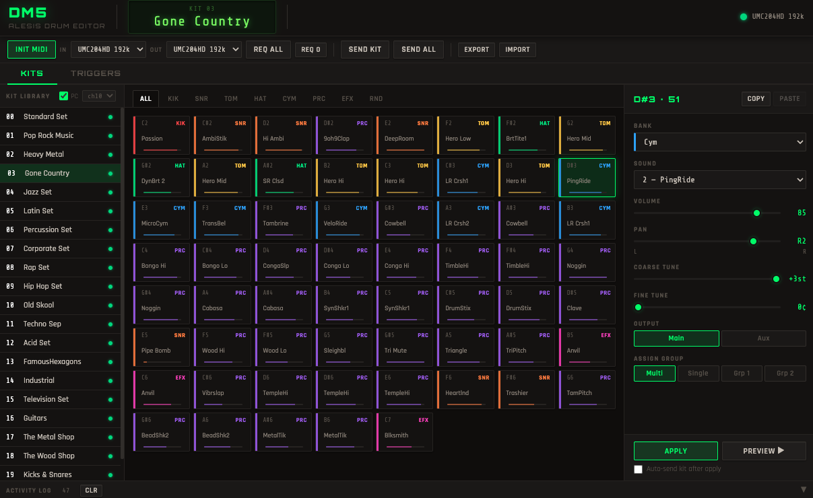

# Alesis DM5 Editor

A Mac desktop editor for the Alesis DM5 MIDI drum module. Edit all 21 kit slots, browse and assign sounds from the full 552-voice library, adjust tuning and mix settings, and send/receive kits over MIDI SysEx — all without menu-diving on the module itself.



---

## Features

- **Full kit editor** — volume, pan, bank, sound, coarse/fine tune, output (main/aux), assign group for all 61 pads per kit
- **Complete 552-voice sound library** — all 8 banks with official Alesis voice names
- **Live NRPN preview** — hear sound changes in real time as you edit
- **Program Change on kit select** — clicking a kit in the browser switches the module to it instantly
- **Trigger Setup screen** — request and edit all 12 trigger parameters (gain, velocity curve, cross-talk, noise floor, decay)
- **Kit Drum Map** — edit trigger note assignments, root note, and footswitch notes per kit
- **Send / Receive all 21 kits** — with correct SysEx timing
- **Export / Import JSON** — save and restore your entire kit library
- **Copy / Paste pads** between kit slots
- **Activity log** — full visibility of all MIDI communication

---

## Requirements

- Mac (macOS 10.15 or later, Intel or Apple Silicon)
- Alesis DM5 drum module
- MIDI interface with 5-pin DIN connectors
- Two MIDI cables: one from your interface MIDI OUT to DM5 MIDI IN, one from DM5 MIDI OUT to interface MIDI IN

---

## Install and run from source

Requires [Node.js](https://nodejs.org) (v18 or later).

```bash
git clone https://github.com/suavekeith/Alesis_DM5_Editor.git
cd Alesis_DM5_Editor
npm install
npm start
```

---

## Build a distributable DMG

```bash
npm run dist
```

This produces an Intel + Apple Silicon universal DMG in the `dist/` folder.

---

## Usage

1. Launch the app and click **INIT MIDI**
2. Select your MIDI interface in the **IN** and **OUT** dropdowns
3. Click **REQ ALL** to load all 21 kits from the module
4. Click any kit in the browser to select it — the module switches to it via Program Change
5. Click a pad to open the editor panel, make changes, then click **APPLY**
6. Click **SEND KIT** to write the edited kit back to the module

For trigger settings, click the **TRIGGERS** tab, press **REQUEST SETUP**, then adjust gain, velocity curve, cross-talk, noise floor and decay for each of the 12 triggers.

---

## Resources

- [Alesis DM5 product page](https://www.alesis.com/products/view/dm5)
- [Alesis DM5 Sound Chart](https://www.alesis.com/rscdn/1580/documents/dm5_soundchart.pdf)
- [Alesis D4/DM5 MIDI Implementation](d4d5midm.pdf) — included in this repo

---

## License

MIT — see [LICENSE](LICENSE)
